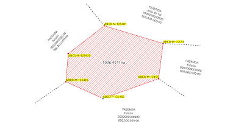

# QField - Otimizando Levantamentos de Campo
 **[QField](https://qfield.org/docs/pt/user-guide/index.html)**
---
## Projeto: qfield_sigef

Abaixo iremos construir um projeto no **[QGIS](https://qgis.org/pt_BR/site/)** para coleta de informações durante o levantamento de campo em imóveis rurais para inclusão no **[Sistema de Gestão Funsiária do INCRA - SIGEF](https://sigef.incra.gov.br/)**.

---
## Projeto



---
### Parâmetros do projeto

* O projeto será constituído de camadas com geometria e sem geometria;
* Será utilizado o **[GeoPackage](https://www.geopackage.org/)** para armazenar as informações;
* As camadas geométricas serão:
   * Ponto - conterá os vértices levantados
   * Linha - conterá os confrontantes
   * Área - conterá o imóvel levantado
* As camadas sem geometria serão:
   * Vértices - tabela com tipos de vértices conforme **[Manual de Limites e Confrontações - pág. 18](https://sigef.incra.gov.br/static/documentos/manual_tecnico_limites_confrontacoes_1ed.pdf)**
   * Limites - tabela com tipos de limites conforme **[Manual de Limites e Confrontações - pág. 15](https://sigef.incra.gov.br/static/documentos/manual_tecnico_limites_confrontacoes_1ed.pdf)**
   * Métodos de Levantamentos - tabela com tipos de levantamentos conforme o tipo de vértice segundo o **[Manual Técnico de Posicionamento - pág. 27](https://sigef.incra.gov.br/static/documentos/manual_tecnico_posicionamento_1ed.pdf)**
---
### Atributos das Camadas

* Geomtétricas:
   * Ponto

    ```
      SRC - EPSG:     4674 (sirgas 2000)
      nome            tipo    valor
      credenciado:    text    010
      vertice:        text    001
      codigo:         text    020
      limite          text    003
      levantamento:   text    003
      obs:            text    100
      foto:           text    255
   ```
   * Linha

   ```
      SRC - EPSG:     4674 (sirgas 2000)
      nome            tipo    valor
      tipo:           int     001
      faz:            text    200
      prop:           text    100
      ccir:           text    013
      doc:            text    020
      juridico:       text    080
   ```

   * Area
   ```
      SRC - EPSG:     4674 (sirgas 2000)
      nome            tipo    valor
      area:           real    
   ```
* Não Geométricas
   * Vertice
   ```
      nome            tipo    valor
      chave:          text    001
      valor:          text    100    
   ```
   * Limites
   ```
      nome            tipo    valor
      chave:          text    003
      valor:          text    100    
   ```
   * MetodoLevantamento
   ```
      nome            tipo    valor
      chave:          text    003
      valor:          text    100    
   ```
---
## Vídeo

](https://studio.youtube.com/video/Ax3vZ_Sk39c/edit)


---
### Observações:

* O QField só está disponível para sistemas android;
* O arquivo de projeto do QGIS tem que está salvo com a extensão .qgs pois ele não lê a extensão .qgz do qgis 3.x;